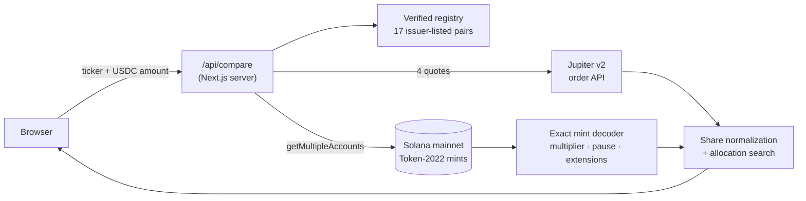

# Assay

**The price behind the ticker.** On Solana, the same stock is sold as different tokens by different issuers. Assay tells you which token buys you **more of the real stock** for your money, using live Jupiter quotes and each token's on-chain share multiplier. Then you can **buy the cheaper token** from your own wallet.

**Live app:** https://agentsure-web-yrz8.vercel.app · Solana mainnet · buying capped at $5 per order
**First mainnet buy:** [1 USDC → 0.00295111 AAPLx on Solscan](https://solscan.io/tx/5AVb6bYb5Vszu2XNysCG1KNXhzQqaWTTNJWYeUvtmHeQMSm2hWre328PpzsRpVivG1Jd6nygUwa1Gy4RZ7YBgc3D)
**Track:** Stocklana 2026, main track

---

## The problem

Apple on Solana isn't one token. It's **AAPLx** (issued by xStocks/Backed) and **AAPLon** (issued by Ondo), and 229 other stocks are offered by both issuers too. The token prices can't be compared directly:

- **One token isn't one share.** Each issuer reinvests dividends by raising a _multiplier_ stored on the token's mint (Token-2022 Scaled UI Amount). One AAPLx is currently worth ×1.0033 shares and one AAPLon ×1.0034. The numbers differ per stock and per issuer, and they change over time.
- **Splits make it much worse.** After Netflix's 10-for-1 split, one NFLXx token is **10 shares**. On Jupiter a token costs about $719, while the stock is about $72. Compare token prices and you're off by 10×.
- **Price depends on size.** A $1 order and a $250,000 order take different routes (aggregator vs. RFQ market makers), so the cheaper token at one size can lose at another.

A trader looking at token prices can't tell which token is actually cheaper. Assay can.

## What Assay does

1. **You pick a stock and an amount** in USDC, from $1 to $250,000.
2. **Assay gets real quotes** from Jupiter for the full amount in each token, plus a 50/50 split across both.
3. **Assay reads both token mints on-chain** and converts every quote into **real share equivalents** using the multiplier currently in effect.
4. **You see cost per real share** for each token, the spread between them, the winner, and how much extra stock the winner buys. It also checks whether splitting helps; so far it hasn't at the sizes tested, and Assay says so.
5. **You buy the cheaper token** with Phantom, Jupiter Wallet or Solflare. Before signing you see what you pay, the shares you get, the **guaranteed minimum** (or the trade fails), and the exact SOL cost. Your wallet approves every trade, and you get a Solscan receipt.

## Proof: live mainnet results

All 17 markets run through the production code path against mainnet (`tests/live.smoke.test.ts`), $10,000 USDC per stock, US market open, September 24, 2026:

| Stock  | xStocks $/share | Ondo $/share | Cheaper | Spread   |
| ------ | --------------- | ------------ | ------- | -------- |
| AAPL   | 338.6217        | 338.6221     | xStocks | 0.0 bps  |
| NVDA   | 223.8498        | 223.9036     | xStocks | 2.4 bps  |
| TSLA   | 379.6164        | 379.8554     | xStocks | 6.2 bps  |
| MSFT   | 495.7460        | 496.1458     | xStocks | 8.0 bps  |
| GOOGL  | 341.6955        | 341.6045     | Ondo    | 2.6 bps  |
| AMZN   | 248.2391        | 248.2498     | xStocks | 0.4 bps  |
| META   | 770.4891        | 770.7277     | xStocks | 3.0 bps  |
| NFLX ⓘ | 71.8910         | 71.8538      | Ondo    | 5.1 bps  |
| AMD    | 617.2260        | 617.6463     | xStocks | 6.8 bps  |
| COIN   | 199.5820        | 199.7081     | xStocks | 6.3 bps  |
| HOOD   | 122.0629        | 122.1935     | xStocks | 10.6 bps |
| MSTR   | 162.5470        | 162.8010     | xStocks | 15.6 bps |
| PLTR   | 193.7938        | 193.7201     | Ondo    | 3.8 bps  |
| CRCL   | 93.2547         | 93.3864      | xStocks | 14.1 bps |
| SPY    | 767.8878        | 768.3493     | xStocks | 6.0 bps  |
| QQQ    | 740.2640        | 740.8186     | xStocks | 7.4 bps  |
| GLD    | 392.4727        | 392.3993     | Ondo    | 1.8 bps  |

ⓘ NFLX: both tokens carry a ×10 multiplier after the split. Assay reports ~$71.89 per real share, where the naive per-token price is ~$719.

**What the table shows:**

- **The winner changes by stock.** xStocks was cheaper for 13 of 17 and Ondo for 4. At other moments and sizes it flips; AAPL at $10k went to xStocks before the open and to Ondo after.
- **The gap is real money at size.** 15.6 bps on MSTR is about $15.60 per $10,000. The hosted app showed AAPL at $250,000 buying 0.147 more shares via the cheaper token, **+$49.53**.
- **The conversion is right.** Two independent issuers land within 0.2% of each other on every stock. A wrong multiplier would be off by whole percentages, or 10× on NFLX.

### First mainnet buy

On September 24, 2026 at 19:54 UTC, the buy flow bought AAPLx through the app with a real wallet ([Solscan](https://solscan.io/tx/5AVb6bYb5Vszu2XNysCG1KNXhzQqaWTTNJWYeUvtmHeQMSm2hWre328PpzsRpVivG1Jd6nygUwa1Gy4RZ7YBgc3D), slot 450129188, finalized). Checked on-chain afterwards:

| Check    | Result                                                                                                   |
| -------- | -------------------------------------------------------------------------------------------------------- |
| Signer   | Only the user's wallet                                                                                   |
| Paid     | 1.000000 USDC                                                                                            |
| Received | 0.00295111 AAPLx (the verified xStocks mint) = **0.0029608 Apple shares** after the ×1.003269 multiplier |
| SOL cost | 0.0000055 SOL network fee + ~0.00156 SOL one-time token account deposit                                  |

## Why you can trust the numbers

| Risk                       | What Assay does                                                                                                                                                                                                                                                                                                                                                                                           |
| -------------------------- | --------------------------------------------------------------------------------------------------------------------------------------------------------------------------------------------------------------------------------------------------------------------------------------------------------------------------------------------------------------------------------------------------------- |
| Fake or look-alike tokens  | Every mint comes from the issuer's own published list: the [xStocks public API](https://api.xstocks.fi/api/v2/public/assets) and [Ondo's mainnet constants](https://github.com/ondoprotocol/gm-solana-simulator/blob/main/constants.rs). Nothing is taken from token search results.                                                                                                                      |
| Wrong share conversion     | `shares = raw amount ÷ 10^decimals × active multiplier`, as both issuers document ([xStocks](https://docs.xstocks.fi/developers/multipliers), [Ondo](https://docs.ondo.finance/ondo-global-markets/token-and-quote-pricing)). The multiplier is read from the chain on every request, never hard-coded.                                                                                                   |
| Stale multiplier           | Token-2022 stores a current and a scheduled multiplier. Assay applies whichever is in effect now. On AAPLx the stored "current" field is out of date, and reading it naively would undercount shares by 0.06%. Covered by tests.                                                                                                                                                                          |
| Token state changes        | Each request re-checks the program, decimals, symbol, exact extension set, pause flag and transfer hook. Any change stops the comparison.                                                                                                                                                                                                                                                                 |
| Corporate action mid-quote | Within 15 minutes of a multiplier update (issuer guidance), Assay refuses to compare rather than risk mixing old and new ratios.                                                                                                                                                                                                                                                                          |
| Floating-point errors      | All money math uses `bigint` and exact fractions. The on-chain binary64 multiplier is decoded bit-exactly into a fraction.                                                                                                                                                                                                                                                                                |
| Stale or fake data         | Live mode never falls back to demo data or cached quotes. Provider failures return a clear error instead.                                                                                                                                                                                                                                                                                                 |
| Buying safely              | Buying is off unless `ASSAY_EXECUTION=on`, and capped per order ($5 by default, never above $25). The server picks the mint from the verified registry, re-checks it on-chain, and confirms the transaction requires the user's own signature before the wallet sees it. The server never holds keys. If a result is unclear, the app says "check Solscan, do not resubmit" and never retries on its own. |
| Leaked keys                | Jupiter and RPC keys stay server-side. Tests assert that no response contains them.                                                                                                                                                                                                                                                                                                                       |

## How it works



- **One comparison makes 5 calls**, all in parallel, taking about 1.2 s: one RPC read of both mints, plus 4 Jupiter quotes (full order on each token, and each half of a 50/50 split).
- **Solana-native pieces:** the Token-2022 Scaled UI Amount extension, decoded from raw account bytes; Jupiter v2 `/order`, covering both the Metis aggregator and JupiterZ RFQ routes; and mainnet slot numbers shown with each result.
- **Built for free tiers:** Jupiter's free key allows 10 requests per 10 seconds. Assay queues bursts inside that budget, shares one set of quotes between identical requests, and the UI retries automatically instead of failing.
- **Buying:** `/api/buy/quote` asks Jupiter for an order built for your wallet. Your wallet signs it (Wallet Standard `solana:signTransaction`, sign only). `/api/buy/execute` then hands it to Jupiter `/execute`, which lands it and lets RFQ market makers co-sign.
- **No database, no custody, no deployed program.** Assay is stateless, and your keys never leave your wallet.

## Try it

**In the app:** open the [live app](https://agentsure-web-yrz8.vercel.app), pick **NFLX**, and compare **10k**. Then try **AAPL** at **250k** and at **1**. Click a token name to open its mint on Solscan. To buy, compare at **1**, connect a wallet holding a little USDC and SOL, and follow **Buy the cheaper token**.

**Through the API:**

```sh
curl "https://agentsure-web-yrz8.vercel.app/api/compare?ticker=NFLX&amount=10000"
curl "https://agentsure-web-yrz8.vercel.app/api/health"
```

## Run locally

Requires Node 22.13+ and npm.

```sh
npm ci
cp .env.example .env.local
npm run dev            # http://localhost:3000
```

With no keys, the app runs in **demo mode**: clearly labeled synthetic data that exercises the guards, including stale oracle, closed market and wide confidence scenarios. For **live mode**, set these in `.env.local`:

| Variable             | Value                                                                                                          |
| -------------------- | -------------------------------------------------------------------------------------------------------------- |
| `ASSAY_MODE`         | `live`                                                                                                         |
| `JUPITER_API_KEY`    | Free key from [developers.jup.ag/portal](https://developers.jup.ag/portal)                                     |
| `SOLANA_RPC_URL`     | HTTPS mainnet RPC. A dedicated provider such as Helius works best; the public RPC may throttle hosted traffic. |
| `ASSAY_EXECUTION`    | `on` to enable wallet buying (default `off`)                                                                   |
| `EXECUTION_MAX_USDC` | Per-order cap, 1–25 (default `5`)                                                                              |

Never put keys in `NEXT_PUBLIC_*` variables.

## Tests

```sh
npm run check   # formatting, strict TypeScript, 111 tests, production build
LIVE_SMOKE=1 node --env-file=.env.local node_modules/.bin/vitest run tests/live.smoke.test.ts   # opt-in: all 17 markets on mainnet
```

The suite covers:

- **Real data:** mint decoding against captured mainnet bytes, and share math at u64 boundaries.
- **Fail-closed checks:** every drift condition (paused, extension added or removed, symbol, decimals, hook, foreign program) and multiplier-update windows.
- **Providers:** rate limits and the call budget, outage handling, secret leakage, parameter tampering, and the US market calendar.
- **Buying:** off by default, the per-order cap, strict request bodies, rejecting a transaction that doesn't need the user's signature, plain insufficient-funds messages, declined signatures, and "outcome unknown, don't resubmit" when a submission times out.

## Scope and limits

- **Buying is capped and single-token.** Up to $5 per order during launch, one token per order. Split buys aren't executed, because two legs aren't atomic.
- **Comparison quotes are indicative.** The comparison isn't a guaranteed fill. A buy always re-quotes for your wallet and enforces a minimum received amount.
- **Issuer to issuer.** Assay compares issuers against each other, not against an exchange reference price. A Pyth fair-value check is built as an adapter but not enabled, pending feed access.
- **17 markets are admitted.** About 213 more are offered by both issuers and will be added only after passing the same checks.
- **Issuer terms differ.** Rights, restrictions and dividend handling vary by issuer; Assay compares economic share exposure only.

## Roadmap

1. **Sell and rebalance:** sell a holding back to USDC, or switch to the cheaper issuer in one flow.
2. **Fair-value guard:** compare both tokens against a Pyth equity reference once access is verified.
3. **More markets:** admit the remaining overlapping stocks through the same automated verification.
4. **Alerts:** notify when the spread on a holding crosses a threshold.

## Project map

| Path                        | What's there                                                                                                                                             |
| --------------------------- | -------------------------------------------------------------------------------------------------------------------------------------------------------- |
| `src/domain/`               | Exact amounts, Token-2022 mint decoder, share normalization, allocation search, guards, market calendar                                                  |
| `src/server/live.ts`        | Live orchestration: mint checks, quote sampling, free-tier call budget, request sharing                                                                  |
| `src/server/registry.ts`    | The 17 issuer-verified token pairs, with evidence links                                                                                                  |
| `src/server/providers/`     | Validated adapters: Jupiter v2, Solana RPC, Pyth (not enabled)                                                                                           |
| `src/app/`                  | Next.js page and API routes (`/api/compare`, `/api/buy/quote`, `/api/buy/execute`, `/api/health`)                                                        |
| `src/components/`           | The comparison desk and buy panel (responsive, light and dark), plus Wallet Standard helpers                                                             |
| `src/domain/transaction.ts` | Minimal transaction inspector: checks the user is a required signer                                                                                      |
| `tests/`                    | Unit, contract and opt-in live tests, plus captured mainnet mint fixtures                                                                                |
| `docs/`                     | [Validation log](docs/VALIDATION.md), [asset verification](docs/ASSET_VERIFICATION.md), [architecture](docs/ARCHITECTURE.md), [sources](docs/SOURCES.md) |

## Disclosure

Built for Stocklana 2026 as a new Solana implementation. Third-party packages are listed in `package.json` and locked in `package-lock.json`: Next.js, React, Zod, Wallet Standard (`@wallet-standard/app`, `@wallet-standard/base`), Vitest and Prettier. Market data comes from Jupiter and Solana mainnet; token addresses and share semantics come from the issuers' published sources linked above. An open-source license has not been selected yet.
