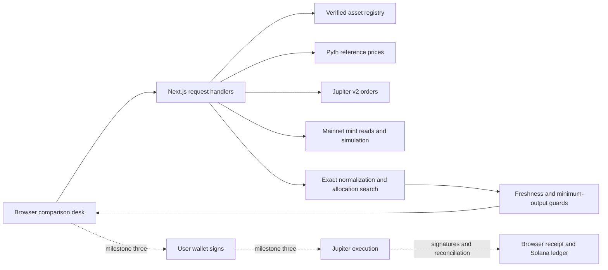

# Architecture

## Product boundary

Assay compares economic stock exposure across verified Solana wrappers. Initial market: USDC -> AAPL wrappers, then NVDA if both issuer mappings, price feeds and actual Jupiter routes pass verification. The equity reference is a benchmark, not a guaranteed redeemable fair value. Issuer risk, rights, market hours and corporate actions remain visible distinctions.

The first release favors a working single-wrapper purchase with a strong comparison surface. Split execution is a later gate within this sprint, not a condition for shipping a safe end-to-end demo.

## System

Implemented now: UI, demo and live comparison endpoints, domain logic, verified AAPL registry, Token-2022 mint reads over RPC, live Jupiter quote orchestration, request validation, typed error boundaries, configuration health and tests. The Pyth reference, simulation, wallet and execution arrows are still pending. No external program deployed.

## Request lifecycle

1. Validate ticker against an issuer-reviewed registry; accept a decimal string in USDC units. Enforce minimum and maximum budget, strict known parameters and no arbitrary mint or upstream URL.
2. Fetch equity and USDC reference data together; wrapper feeds are contextual market observations, not circular sources for shares-per-token. Retain feed ID, timestamp, exponent and confidence. Validate missing/duplicate/substituted feeds.
3. Read the mint account, decimals, program owner, extensions and effective multiplier. Confirm economic exposure independently from issuer documentation/data. Never apply dividend adjustments twice.
4. Obtain complete ExactIn quote samples: 100/0, 75/25, 50/50, 25/75, 0/100. For two wrappers this requires up to eight provider calls. Keep integer dust in the complementary leg. Cap request duration and total calls; return partial coverage explicitly or fail, without inventing a price. Do not send eight simultaneous calls into a 1 RPS tier.
5. Choose the sampled allocation with greatest normalized exposure valued at the equity reference, minus estimated network costs. Provider fees included in output must not be subtracted twice. Include separately reported costs, rent, and fee currency conversion at execution review. Prefer fewer legs on ties.
6. Explain the result as estimated additional exposure value, not guaranteed dollars saved. If the full-size baseline cannot be quoted, no comparative savings claim is possible.
7. Before any wallet request, obtain new executable orders; recompute costs, minimum share output, oracle guards and normalization. If changed, show a new review. A quote-only response is not a trade approval.

## Numeric contract

- External amounts are decimal **strings**. Solana raw amounts are bounded u64 values, held internally as `bigint`.
- `shares = raw / 10^decimals × activeDisplayMultiplier × sharesPerDisplayUnit`.
- Economic exposure needs issuer evidence. Ondo total-return reinvestment is not assumed to mint extra wallet tokens. A token display multiplier alone cannot establish equivalence.
- SPL Token-2022 multiplier storage uses floating-point values. The future mint reader must decode the f64 bits to an exact rational (including scheduled multiplier) or preserve an authoritative decimal representation with explicit precision rules. Do not convert raw balances to `Number` or use SDK UI convenience conversions for routing.
- Applying a multiplier at its activation timestamp is required. If that timestamp falls within the quote/transaction validity window, block and re-read after the transition.
- `spendUSD = inputUSDCraw / 10^6 × USDC/USD`. USDC is not assumed perfectly pegged.
- Premium guard uses the quote's **minimum** received amount. Optimistic outAmount alone does not protect the accepted execution range.
- Truncate only for display. No formatted number is reused as an amount.

## Oracle policy

Default foundation thresholds: 60-second oracle age, 50 bps maximum confidence, 100 bps maximum premium, 20-second comparison lifetime. These are configurable policy starting points to validate against real feeds, not claims of universal safe thresholds. Both equity and USDC feeds are required for USD comparisons.

Market closed, stale, future timestamp, missing feed, unknown session, unverified exposure, or excessive confidence -> comparison only. Never widen bands automatically because the stock market closed. The last published price may be shown with its timestamp, but must not be called “official close” without a close-price source. A holiday/half-day-aware calendar or authoritative market-status feed is required before labeling live sessions; weekday/time heuristics alone are insufficient. Until that adapter exists, live market state is unknown.

Wrapper feeds can show off-hours market observations. They are not an independent equity fair-value replacement and cannot establish issuer conversion ratios.

## Execution gate (milestone three)

- Wallet holds keys. Server never receives private keys or seed phrases.
- Launch cap: at most 1 USDC principal per test, only after the actual route permits that size. Raise only after documented tests, not by changing the quote size selector. Quoting up to 250k does not raise the execution cap.
- Check SOL, USDC, priority fees, account creation rent and issuer access requirements before signing. Never automatically top up or spend the remaining SOL reserve.
- Bind a short-lived server-authenticated execution intent to wallet, mints, exact input, slippage/min-output, normalization snapshot and quote/request ID. Revalidate at each step; browser fields are untrusted.
- Validate Jupiter transaction contents: signer/fee payer, token accounts and recipients, input budget, fees/tips, minimum output, relevant programs and address lookup tables. Reject unknown extra instructions, transfers, token approvals and unsupported extensions. Simulate with the correct transaction/blockhash and check program errors. A simulation pass is not a fill guarantee.
- Jupiter v2 `/order` + `/execute` is the proposed managed path; test which router serves the actual equity pair. Some RFQ paths have different signature/landing semantics. Persist request IDs before execute and reconcile them as well as signatures; do not assume the user's partial signature is the eventual transaction ID. Do not modify RFQ transactions. If the inspection policy cannot support a router, exclude it or disable that route.
- Cross-wrapper transactions are not atomic. For the MVP, execute the first leg, confirm, then re-quote/re-check the remainder and obtain fresh user approval. Show partial completion if the second leg fails or is no longer acceptable. Do not claim the earlier split estimate will remain executable.
- Preserve an execution receipt in browser storage before broadcast/execute: intent ID, wallet, request ID, signed transaction identity if determinable, blockhash validity and each leg's state. This is a UX recovery mechanism, not trusted authorization or distributed exactly-once storage. Reconcile with Jupiter/Solana on reload. No unattended operation when the page is closed.
- `unknown` is a blocking state. Do not build a replacement transaction after a timeout until its prior attempt is resolved or proven expired with no fill. Same signed transaction rebroadcast is different from signing a new swap. Automated fresh-order retry is out of scope.
- Current reducer models local signature-bearing transitions only. Expand it for provider request-ID reconciliation before enabling RFQ execution; it is not yet a working recovery subsystem.

## Stateless hosting and scale

Next.js request handlers are the only backend. Keep API keys/RPC URL in server environment variables. No generic RPC proxy or arbitrary URL fetch endpoint. Responses carry request IDs, strip raw upstream errors, and mark quote data `no-store`.

No DB, worker, queue or custom program. Per-instance in-memory cache/coalescing may reduce duplicate reads, but is neither durable nor a global rate limiter. Before exposing live endpoints, enforce provider/dashboard quotas and hosting edge rate limits; per-browser debounce alone does not prevent credential abuse. Free-tier global provider caps can be exceeded across serverless instances. Fail cleanly with 429/503; never upgrade paid plans automatically. Add a shared limiter only if traffic requires it after the hackathon.

Set a hard provider request budget, conservative deadlines, and zero automatic retry for financial submission. Read retries should be bounded and respect provider rate limits. Cache immutable metadata separately from short-lived prices. Force fresh reads when signing.

No claim of high-volume production readiness until real load, provider quotas, wallet flows, recovery and issuer policies are tested. Large-notional arithmetic correctness and high user concurrency are separate requirements.

## Security and quality gates

The foundation has strict request schemas, bounded amounts, sanitized provider errors, exact financial math, clickjacking/content-type/referrer headers, server configuration isolation and unit/contract tests. Before public mainnet trading: finish transaction inspection, origin checks for execution POSTs, provider abuse controls, CSP compatible with the chosen wallet, secret scanning, receipt recovery and a real mainnet round trip. No secrets in screenshots or logs. No claim of audit certification.
